## Penerimaan!

Aku mengingat semuanya, hari demi hari banyak sekali yang aku alami sejak awal tahun 2023. Menyelesaikan tugas akhir sarjana, sambil mengirim banyak sekali dokumen lamaran pekerjaan dan tak banyak dari itu yang mendapatkan panggilan wawancara.

Hari itu di pertengahan Juli tahun 2023, aku mendapatkan telepon untuk wawancara magang. Siapa yang menyangka bahwa di hari yang sama dengan hari wawancara aku akan mendapatkan kabar penerimaan kerja ke kota sebesar Jakarta yang akan dimulai pekan depan? Aku seperti dipaksa untuk percaya pada perkataan '**apa yang kamu dapatkan hari ini mungkin adalah doamu di hari-hari sebelumnya'**. 💪

## Mengapa Magang?

Sebenarnya tidak ada alasan khusus untuk magang, karena bagaimanapun aku berharap menjadi seorang karyawan setelah menyelesaikan studi sarjana ku. Namun, mungkin karena sebagian perusahaan yang aku lamar mencari posisi dengan pengalaman dua hingga tiga tahun yang membuatku menerima banyak sekali penolakan dalam seleksi penerimaan karyawan.

Pada suatu titik dimana aku merasa jenuh pada masa jeda ini, tepatnya setelah tugas akhir sarjana ku selesai. Setiap hari nya hanya aku isi dengan berada didepan layar komputer, entah itu membuat eksperimen random dengan pemrograman, menonton film, atau membaca meme di media sosial. Yah, memang tidak ada alasan khusus dan aku hanya bosan dengan keseharian ku saat itu wkwk.

Setelah melalui dokumen, hingga wawancara, akhirnya aku lolos di SMP. Dengan antusias, kami menyelesaikan banyak proyek disana. Aku sangat bersenang-senang dengan setiap prosesnya dan seperti menjalani hidup lebih baik. 🪴

## Tempat seperti apa SMP itu?

Perlu diketahui bahwa kesempatan yang aku ambil ini adalah magang. Tapi, menurutku itu tidak terlihat seperti magang. Aku berpikir bahwa ini lebih pas jika disebut belajar sebagai pekerja, aku melakukan semua tugas yang sama dengan teman-teman ku sebagai seorang karyawan.

Disini, aku bertemu dengan banyak orang yang seusia ku. Sehingga aku merasa seperti sedang berada di kelas kuliah wkwk. Aku berbagi banyak cerita dengan mereka, berbagi pengetahuan dan bahkan makan, memasak dan bahkan pergi ke laundry bersama, sangat menggemaskan bukan? wkwk.

Selama dua bulan, ada beberapa yang aku kerjakan diantaranya:

- Proyek pertama adalah Staging Server
- Proyek kedua adalah troubleshooting tower Google Taraa
- Proyek ketiga adalah pengembangan website Curcool dengan NuxtJS dan VueJS
- Proyek keempat adalah proyek USSD

Aku begitu antusias mengikuti dan mengerjakan tiap proyek yang ada di perusahaan kami. Aku berpikir bahwa selama berada disini aku bertumbuh dan menikmati setiap prosesnya.🪴

## Apa yang aku kerjakan?

### Proyek pertama: Staging Server

Proyek pertama adalah staging server yang dikerjakan oleh enam orang selama satu minggu. Staging server adalah aktivitas yang bertujuan untuk menguji server sebelum diluncurkan ke lingkungan produksi. Hasil yang didapat dari ikut serta di proyek ini adalah pengetahuan mengenai jaringan, server, dan juga berfokus pada manajemen server menggunakan Dell iDRAC dan VMWare Esxi.

| 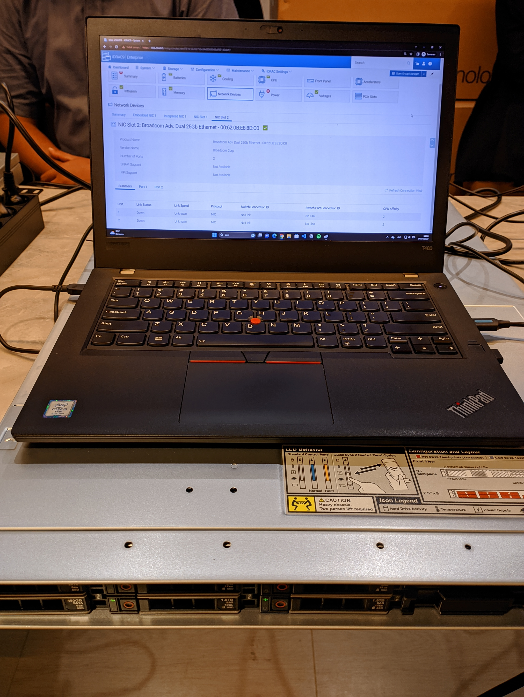 | 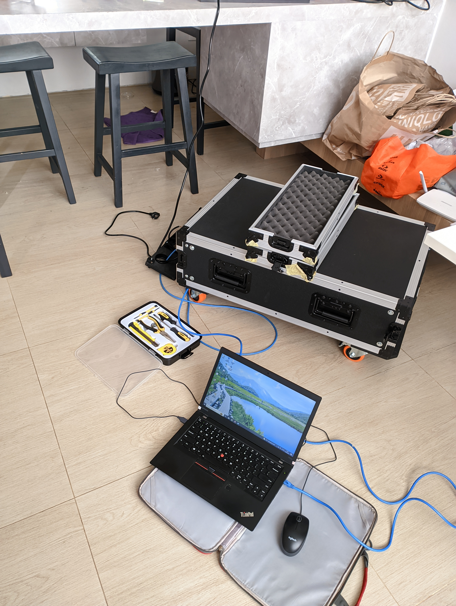 |
| --------------------------------------- | -------------------------------------------------------- |

### Proyek kedua: Google Taraa

Proyek kedua adalah Google Taraa. Disini aku berkontribusi dalam troubleshooting Mini PC yang ada pada Tower Google Taraa. Ya, ini adalah proyek yang sangat diluar ekspektasiku wkwk. Hasil yang didapat dari ikut serta di proyek ini adalah pengetahuan yang lebih mendalam mengenai jaringan.

| 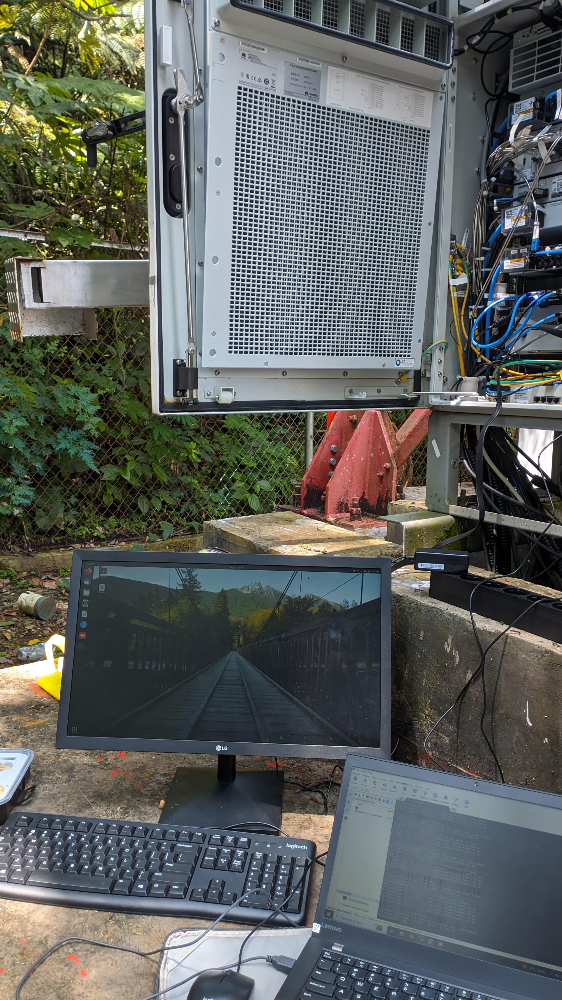 | 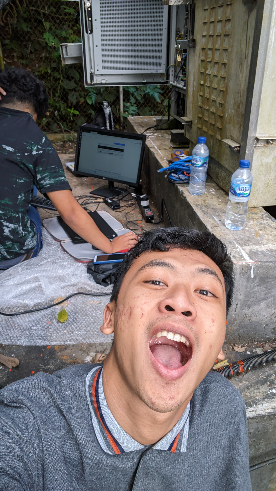 |  |
| ------------------------------------ | -------------------------------- | ------------------------------------------------------ |

### Proyek ketiga: Curcool

Proyek ketiga adalah Curcool. Curcool adalah sebuah platform curhat berbasis online. Pada proyek ini aku berkontribusi pada pengembangan website nya dengan stack yang digunakan adalah bahasa VueJS dengan framework Nuxt. Pada desain web, digunakan TailwindCSS. Hasil yang didapat dari ikut serta di proyek ini adalah pengetahuan dalam proses pengembangan website. Setelah ikut dalam proyek ini juga aku memutuskan untuk bermimpi menjadi seorang SOFTWARE DEVELOPER di masa depan, ah aku bersyukur bisa berada si proyek ini!

| 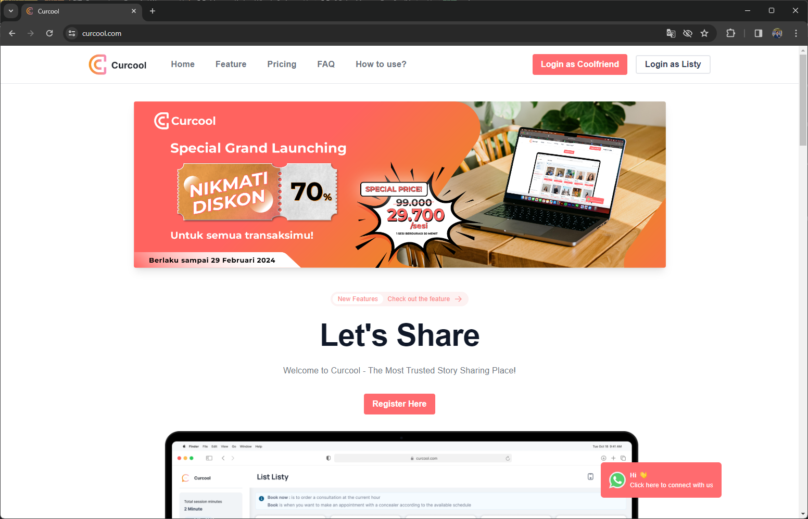 |
| ------------------------------------- |

### Proyek keempat: Telkomsel USSD

Proyek keempat adalah Telkomsel USSD. Yah ini adalah proyek terakhir, tapi ini adalah proyek yang paling berkesan bagiku! Aku dengan antusias hampir setiap hari datang ke kantor. Jaraknya lumayan dari tempat tinggalku menuju kantor, sekitar 30 menit dengan kereta dan belum termasuk perjalanan ke stasiun.

| 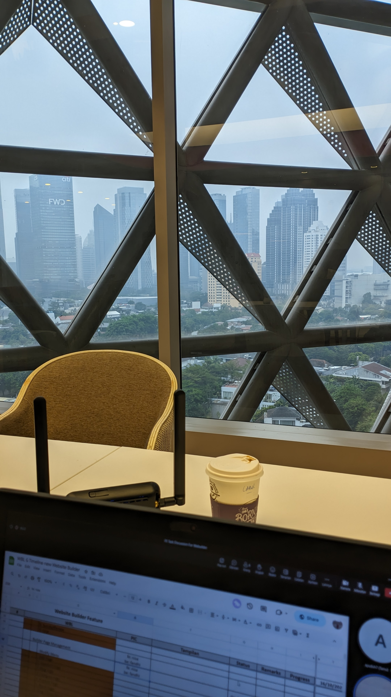 | 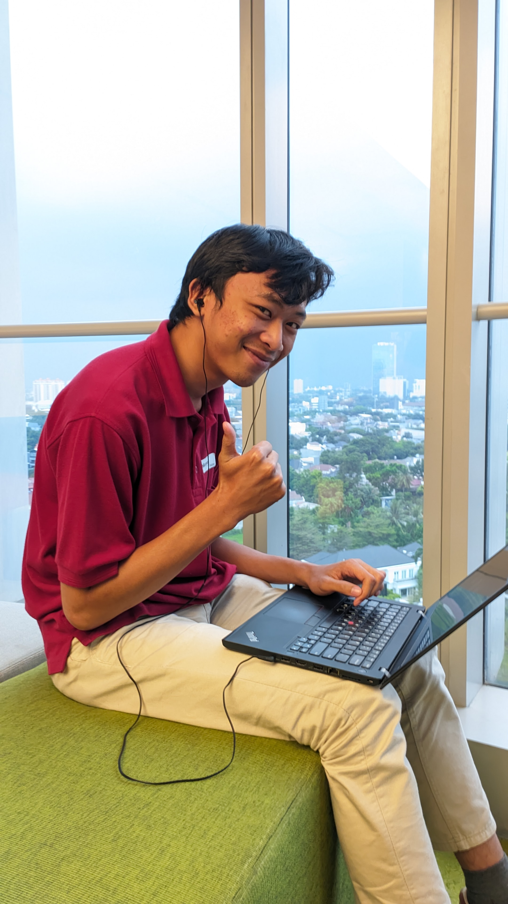 | 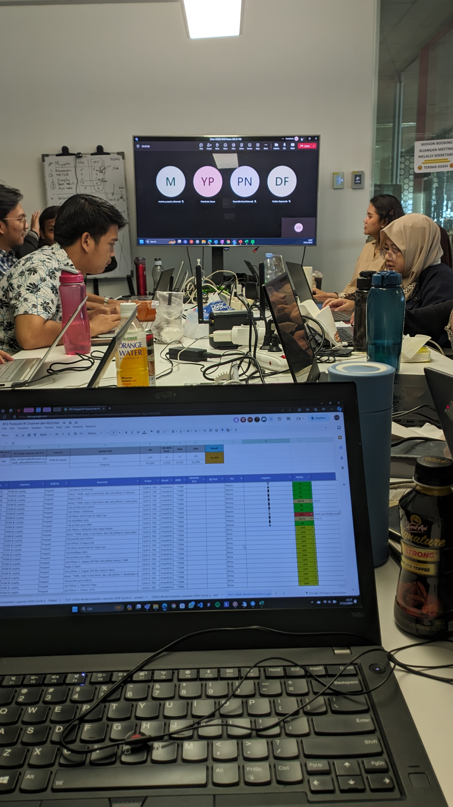 |
| ---------------------------- | ----------------------- | --------------------------- |

Selama kurang lebih setengah tahun, kami melakukan secara baik proses pengembangan. Meskipun banyak sekali kendala yang kami temui, pada akhirnya semuanya dapat diselesaikan dengan baik bersama-sama! Ahh, aku pasti akan merindukan hari-hari itu.

| 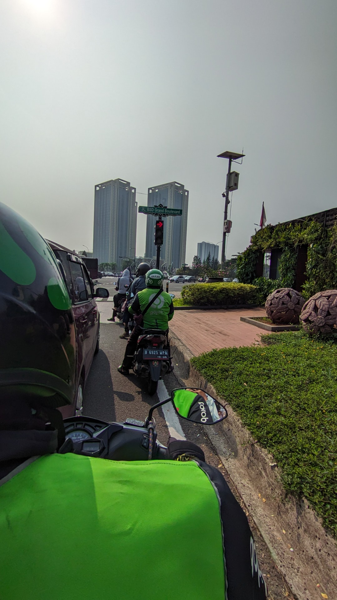 | 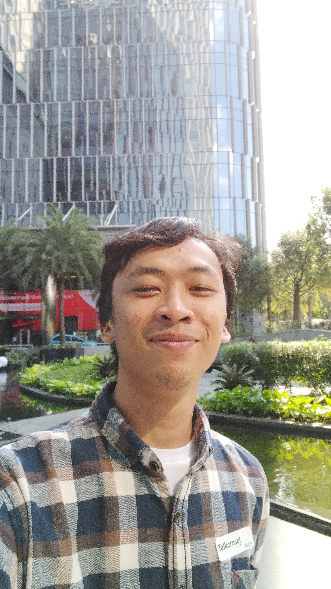 | 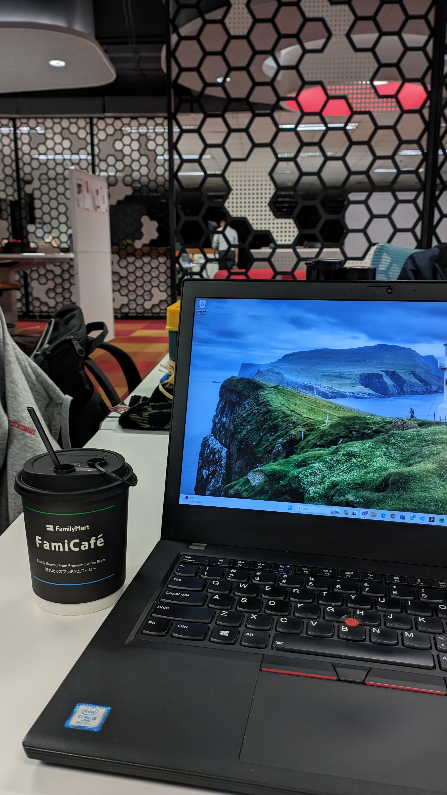 |
| -------------------------------------- | ----------------------------------------------------------- | ---------------------------------------------- |

| 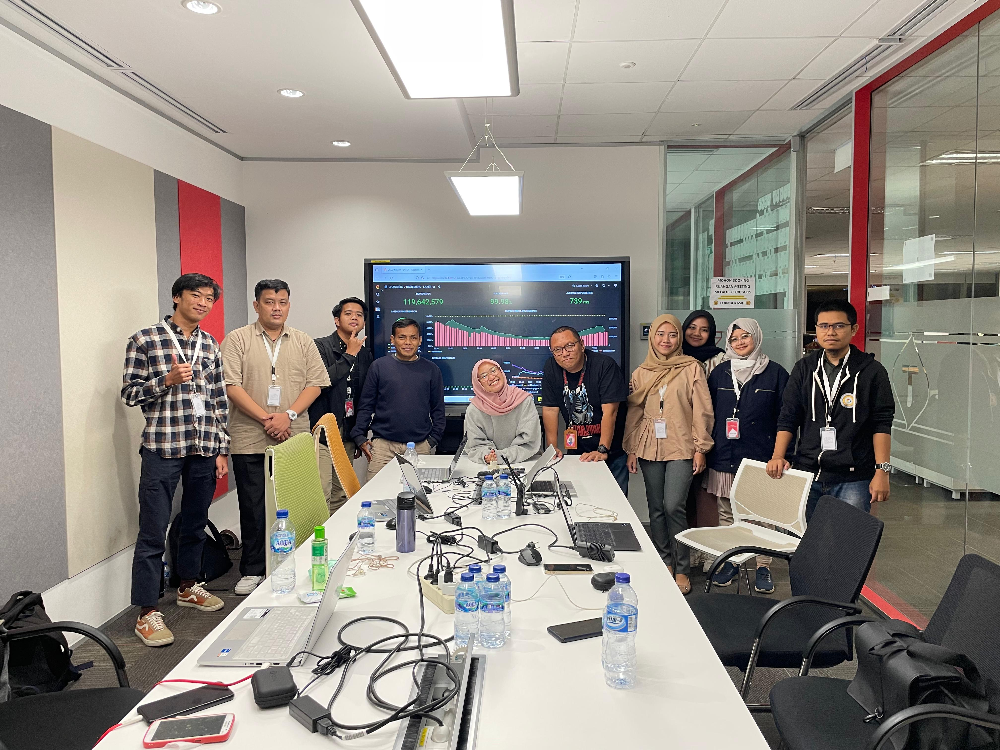 |
| ----------------------------------- |

## Setelah magang…

Aku pikir ini adalah momen yang mengubah sebagian hidup ku. Magang ini merupakan pengalaman yang benar-benar tak terlupakan, dan sungguh menyentuh hati melihat orang-orang yang bahkan tidak aku kenal sebelumnya berkumpul dan menjadi teman yang sangat diperlukan. Melihat orang-orang tumbuh dan berhubungan dengan gembira dan bahagia di perusahaan yang membuat aku dapat merasakan dan belajar banyak.

Di akhir magang, aku menerima tawaran untuk menjadi karyawan tetap disini. Aku sangat menantikan pengalaman berharga lainnya disini! 🔥

```toc

```
