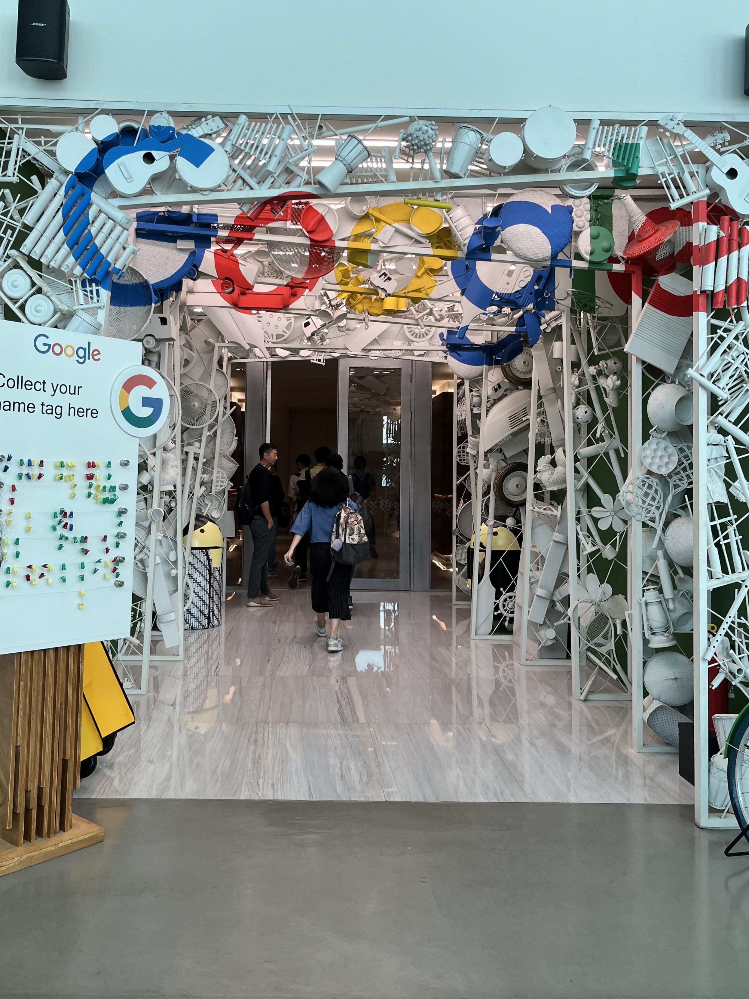
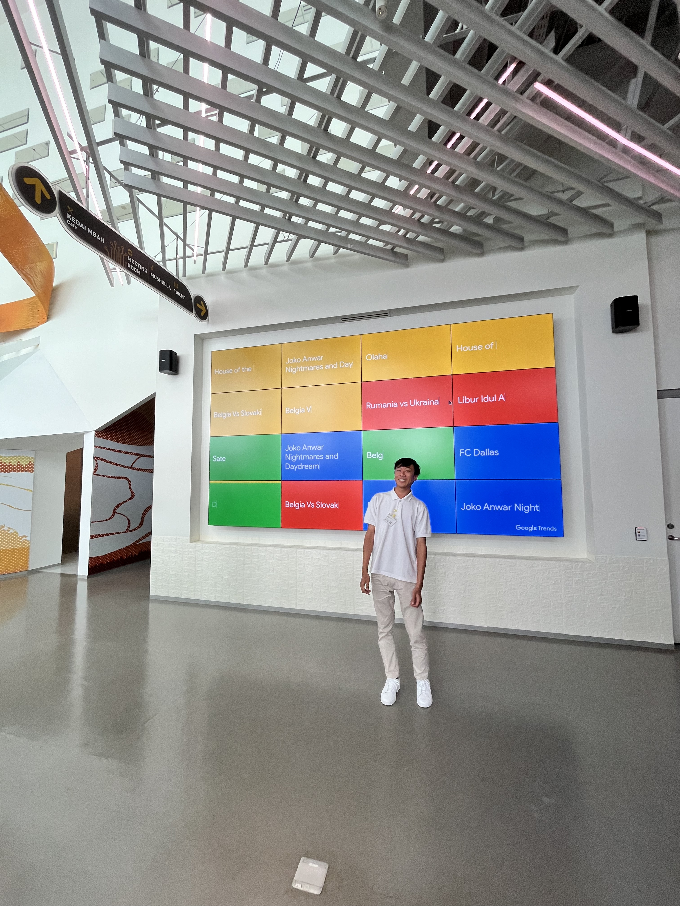
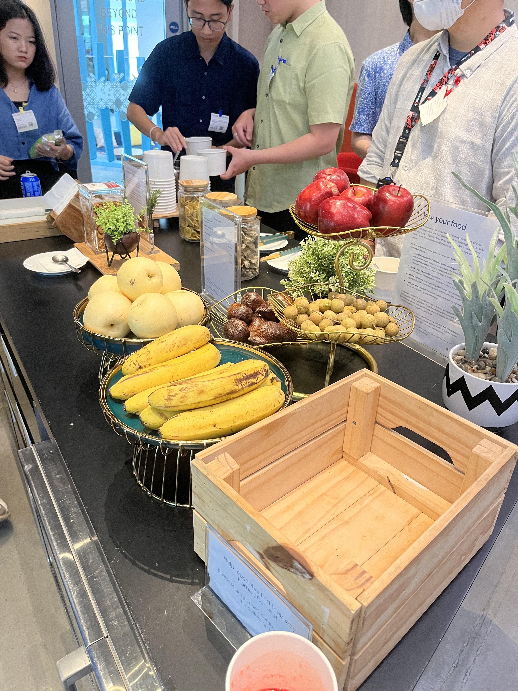
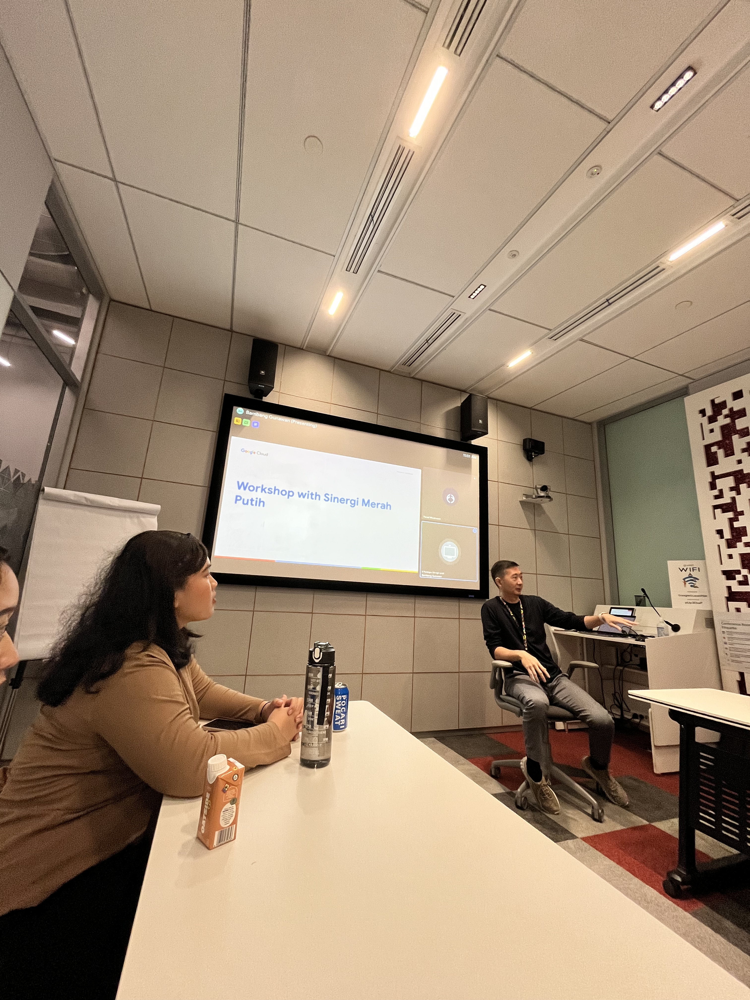
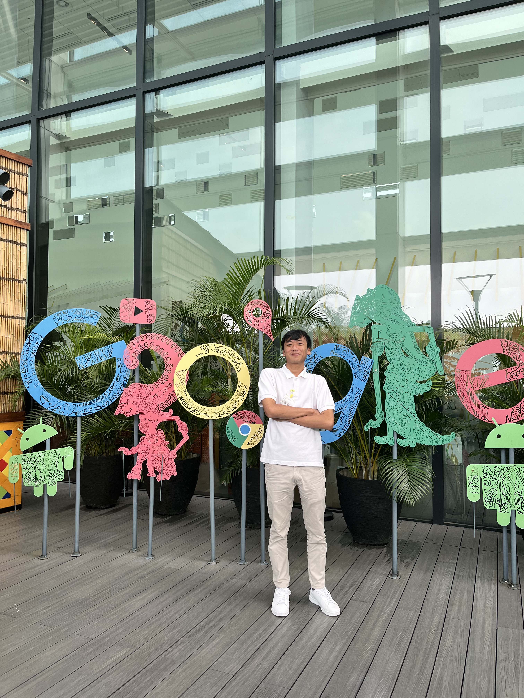
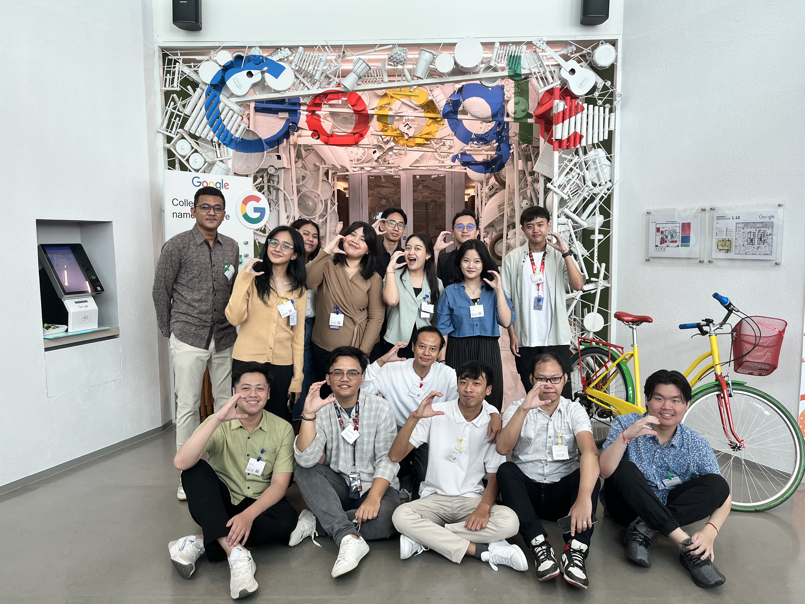

## Pengantar

Beberapa waktu yang lalu, aku berkesempatan mengunjungi kantor Google Indonesia di Jakarta, bagiku ini adalah sebuah pengalaman yang sangat istimewa dan penuh inspirasi. Kunjungan ini terjadi karena perusahaan ku terlibat dalam kemitraan dengan Google dalam proyek Rich Business Messaging. Dalam proyek ini, kami berkolaborasi untuk mengembangkan solusi inovatif di bidang layanan cloud hingga kecerdasan buatan (AI). Keren kan? hehe 😁

Sebagai seseorang yang selalu tertarik dengan teknologi dan inovasi, kesempatan ini terasa seperti mimpi yang menjadi kenyataan. Aku sangat penasaran untuk melihat bagaimana Google, sebagai salah satu perusahaan teknologi terbesar di dunia, menciptakan lingkungan kerja yang mendorong kreativitas dan kolaborasi di tingkat tertinggi. 🛰

Dalam tulisan ini, aku ingin berbagi pengalaman ku selama kunjungan ke kantor Google. Dari desain kantor yang futuristik hingga diskusi mendalam tentang teknologi masa depan, perjalanan ini benar-benar membuka wawasan baru bagi aku. Semoga pengalaman ini juga bisa menginspirasi kamu juga! 🏋️‍♂️

## Kesan Pertama dengan kantor Google

Memasuki kantor Google untuk pertama kalinya adalah pengalaman yang sulit dilupakan. Ketika aku melangkah masuk, suasana inovatif langsung terasa. Menurutku desain interiornya mencerminkan teknologi yang canggih tapi juga tetap mengutamakan kenyamanan. 🤩

Aku kagum dengan setiap sudut kantor yang sepertinya memang dirancang dengan estetika modern dan fungsionalitas yang mendukung kreativitas. Area kerja terbuka dengan meja-meja kolaborasi, lengkap dengan layar interaktif dan teknologi pendukung, memberi kesan bahwa ini adalah tempat di mana ide-ide besar dilahirkan. Selain itu, ruang-ruang ini dipenuhi dengan warna-warna cerah yang menyegarkan mata dan membuat suasana terasa sangat hidup. 📺

Namun, yang paling keren adalah fasilitas unik yang ada di kantor ini. Ada ruang santai dengan bean bag yang nyaman, kafe kecil dengan mesin kopi, hingga ruang makan yang punya banyak sekali snack, dan aku pun juga mencoba banyak makanan disini wkwk. Tak lupa, ada juga ruang permainan yang dipenuhi permainan sepakbola meja (entah apa namanya wkwk), alat musik, hingga kursi pijat otomatis untuk menghilangkan stres. 🎮

Di sepanjang koridor, hiasan tembok yang penuh elemen seni yang mencerminkan misi Google untuk menginspirasi dunia. Beberapa area bahkan menggunakan tema lokal yang membuat setiap kantor Google ini cukup terasa nuansa Indonesia-nya hehe. 🇮🇩

Hal lain yang sangat berkesan adalah integrasi teknologi di setiap aspek kantor. Papan digital yang menampilkan jadwal, ruang rapat dengan teknologi AI untuk konferensi, hingga sistem otomatis untuk mengontrol pencahayaan dan suhu, semuanya dirancang untuk mendukung produktivitas. 👨‍💻

Lingkungan kerja yang serba canggih ini membuat ku semakin paham mengapa Google menjadi tempat impian banyak orang untuk bekerja. Kantor ini bukan hanya tempat kerja, tapi juga tempat yang memicu kreativitas dan inovasi tanpa batas. 🎨

|  |  |  |
| --------------------------------------- | ------------------------------------------------------------- | ------------------------------------- |

## Aktivitas Selama Kunjungan

Kunjungan kami ke kantor Google dimulai dengan tur keliling kantor. Dalam tur ini, kami diajak melihat langsung berbagai fasilitas dan ruang kerja yang didesain untuk mendukung kreativitas dan inovasi. Dari area kolaborasi yang modern hingga ruang-ruang unik seperti area relaksasi dan ruang permainan, semuanya mencerminkan budaya kerja yang dinamis dan fleksibel di Google. 👨‍💻

Setelah tur, kami mengikuti serangkaian presentasi yang membahas produk-produk Google yang relevan dengan proyek kemitraan kami. Para presenter menjelaskan secara detail bagaimana layanan seperti Google Cloud dan solusi AI mereka dapat diimplementasikan untuk membantu kami mencapai tujuan proyek Rich Business Messaging. 📞

Bagian yang paling menarik adalah workshop interaktif. Di sini, kami diberi kesempatan untuk mengeksplorasi lebih jauh teknologi-teknologi Google, mencoba beberapa alat mereka secara langsung, dan mendiskusikan bagaimana solusi tersebut bisa diterapkan secara praktis di proyek kami. Workshop ini tidak hanya informatif tetapi juga memberi kami wawasan baru tentang cara memanfaatkan teknologi untuk menciptakan nilai lebih bagi pelanggan kami. 

Meski tidak ada interaksi langsung dengan karyawan di luar tim presentasi, pengalaman ini tetap sangat berkesan. Kunjungan ini memberi kami pandangan yang lebih mendalam tentang bagaimana Google bekerja dan bagaimana inovasi mereka dapat mendukung berbagai industri di seluruh dunia. 🌏

|  |
| ----------------------------------------------------- |

## Poin Berkesan

Menurutku salah satu momen paling berkesan selama kunjungan ini adalah melihat bagaimana teknologi dan inovasi menjadi inti dari setiap aspek di kantor Google. Mulai dari desain kantor yang mencerminkan kolaborasi, hingga solusi berbasis AI dan cloud yang dipresentasikan kepada kami, semuanya terasa seperti sebuah gambaran masa depan yang sedang diwujudkan. 😇

Workshop yang kami ikuti juga meninggalkan kesan mendalam. Cara Google mempermudah akses ke teknologi kompleks melalui alat-alat yang intuitif benar-benar menunjukkan komitmen mereka untuk membuat teknologi canggih dapat dijangkau oleh semua orang. Selain itu, suasana kantor yang santai namun produktif menunjukkan bagaimana inovasi dapat tumbuh dalam lingkungan kerja yang mendukung keseimbangan.

|  |
| -------------------------------- |

## Refleksi dan Pembelajaran

Kunjungan ini memberikan banyak pelajaran berharga, terutama tentang bagaimana Google mengintegrasikan inovasi dengan kolaborasi. Aku menyadari bahwa teknologi yang hebat saja tidak cukup tanpa ekosistem yang mendukung pengembangannya. Budaya kerja yang mendorong kreativitas, fasilitas yang memungkinkan kolaborasi, dan teknologi yang mudah diakses menjadi kombinasi yang sangat efektif. 🚀

Dari segi proyek kami, aku semakin memahami potensi besar dari solusi Google dalam mengatasi tantangan yang kami hadapi. Kunjungan ini membuka wawasan baru tentang bagaimana teknologi AI dan cloud dapat dioptimalkan untuk menciptakan pengalaman pelanggan yang lebih baik melalui Rich Business Messaging.

|  |
| ------------------------------- |

## Penutup

Kunjungan ke kantor Google bukan hanya tentang melihat tempat kerja impian, tetapi juga tentang memahami bagaimana inovasi dan teknologi dapat mengubah cara kita bekerja dan berkolaborasi. Aku merasa beruntung bisa mendapatkan pengalaman ini, dan berharap apa yang kami pelajari akan berdampak positif pada proyek yang sedang kami kembangkan.

Bagi kamu yang mungkin punya kesempatan serupa di masa depan, aku sangat merekomendasikan untuk membuka pikiran dan menyerap setiap pembelajaran yang bisa diambil. Teknologi terus berkembang, dan perjalanan seperti ini adalah salah satu cara terbaik untuk tetap berada di garis depan inovasi.

Terima kasih telah membaca cerita ku! Jika kamu punya pertanyaan atau ingin berbagi pengalaman serupa, jangan ragu untuk meninggalkan komentar. Hehe 📝

```toc

```
