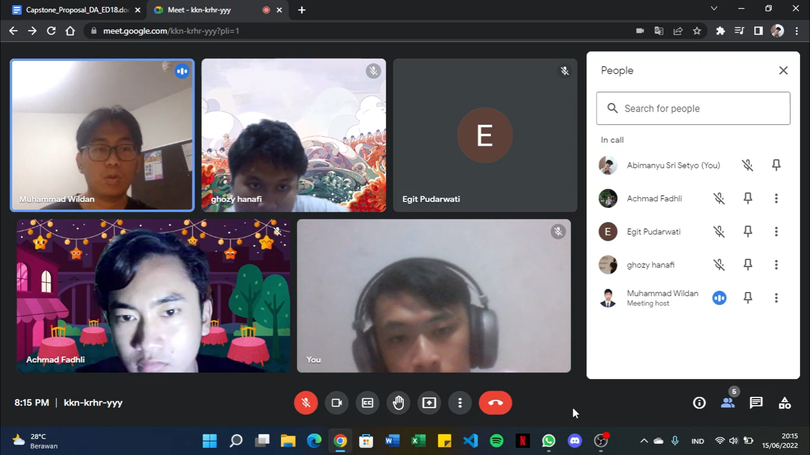

Postingan ini adalah pengalaman berharga saya selama 6 Bulan Magang dan Studi Independen di GoTo.

## Semua berawal dari bagaimana saya mengenal data

Pada awal tahun ini, saya mulai belajar banyak hal tentang data sains. Saya menyelesaikan banyak kursus di internet dan juga mengikuti beberapa seminar. Saya menyadari bahwa awal ketertarikan saya pada bidang ini disebabkan oleh mata kuliah yang saya ambil di semester sebelumnya dimana disana saya tahu banyak hal tentang kecerdasan buatan yang mana membuat saya sadar betapa pentingnya DATA! Hingga pada hari-hari selanjutnya saya mulai aktif di platform LinkedIn dan menemukan profil teman tahun pertama di universitas yang membuat saya terkesan dengan segala pencapaiannya.

## Menjadi bagian dari Generasi Gigih di GoTo

Generasi Gigih merupakan program magang dan studi independen dari YABB, yang berinduk dengan GoTo Group. Saya belajar selama enam bulan dimana saya mengenal Analisa Data di Generasi Gigih.


|  |  |  |
| ------------------------------- | ----------------------- | --------------------------------- |

## Pengetahuan Teknis untuk Analisa Data

Dalam satu pekan, tiga dari lima hari kerja digunakan untuk belajar mengenai pengetahuan teknis untuk melakukan analisa data. Beberapa pengetahuan teknis yang sudah saya pelajari adalah sebagai berikut.

- Pengenalan Data
- Data Analysis
- Bahasa pemrograman Python
- Bahasa pemrograman SQL
- Visualisasi data menggunakan Google Data Studio
- Melakukan eksperimen dengan menggunakan studi kasus

Semua materi yang dipelajari juga diajarkan oleh pembimbing yang berbeda. :)

## Pengetahuan Non-teknis untuk Analisa Data

Sisa hari kerja digunakan untuk belajar mengenai pengetahuan non-teknis. Saya belajar mengenai soft skills yang berguna pada dunia kerja, seperti membuat resume, portofolio, manajemen waktu, membuat personal branding, hingga memperdalam kemampuan berbahasa Inggris saya. Ada yang menarik ketika saya ada di kelas bahasa Inggris, dimana saya di ajar oleh guru bahasa Inggris dari Filipina!, dan betapa gugupnya saya disebabkan kemampuan bahasa Inggris saya yang pas-pasan dan jugadia adalah orang asing pertama yang berbincang dengan saya langsung. wkwk

## Memecahkan masalah dalam Proyek Capstone

Tiga bulan telah berlalu, sehingga dua bulan terakhir saya bergabung pada sebuah tim untuk mengerjakan proyek. Selama bekerja bersama, tim saya terdiri atas lima anggota termasuk saya dan satu kakak pembimbing. Beberapa kali pertemuan diadakan, dimana biasanya pertemuan ini diadakan sore hari hingga tengah malam. Semua kami lakukan secara daring karena pandemi yang juga belum mereda. Selain itu, kakak pembimbing kami juga berada di Australia karena sedang studi master di negara tersebut.

|  |  |
| --------------------------------- | ---------------------------- |

Bidang pendidikan merupakan bidang kasus yang kami selesaikan, dimana fokus kami adalah menganalisa dampak stress dan kesehatan sosial dari pembelajaran daring siswa selama pandemi. Banyak hambatan yang kami temui dalam proses penyelesaian proyek ini, dimana hambatan tersebut seperti sulitnya untuk menemukan dataset yang sesuai dengan penelitian kami, kemudian membersihkan dataset yang kami gunakan, mengolah dataset, hingga membuat dasbor visualisasi hasil dari apa yang kami temukan pada dataset tersebut.

Dalam pengerjaannya, kami berinisiatif untuk membagi tim untuk menyelesaikan tugas secara paralel, dimana tim kami dibagi menjadi dua bagian, yaitu bagian pembersihan dan pengolahan dataset, dan bagian visualisasi dataset. Saya dan teman saya, Ghozy bertugas pada sisi pembersihan dan pengolahan dataset. Alat yang kami gunakan adalah Google Colab dengan menggunakan bahasa pemrograman Python. Namun, terkadang kami juga membantu bagian lain pada sisi visualisasi dataset disebabkan terdapat beberapa penyesuaian dalam pengolahan data ketika dilakukan visualisasi, yang dilakukan pada Google Data Studio.

## Bulan terakhir

Setelah menyelesaikan proyek capstone bersama tim, kami bersiap untuk melakukan presentasi dari hasil analisa data dihadapan para penguji dan penilai. Presentasi proyek diwakili oleh tiga orang pada tim kami, yaitu Ghozy, Egit dan saya. Tim kami awalnya berniat untuk menggunakan bahasa Indonesia ketika menyampaikan presentasi, namun kakak pembimbing kami menyarankan untuk menggunakan bahasa Inggris agar mendapatkan nilai yang lebih baik, dan pada akhirnya kami menggunakan bahasa campuran di hari presentasi karena keterbatasan kami dalam berbahasa Inggris.

Enam bulan telah berlalu, saya belajar banyak hal di tempat ini. Saya bertemu dengan banyak teman dari berbagai daerah, dan juga kakak-kakak yang menginspirasi saya. Saya sangat bersyukur mendapatkan kesempatan ini.

|  |  |
| ---------------------------- | ------------------------------- |

## Perpisahan

Setiap pertemuan pastinya ada perpisahan :'). Pada meeting terakhir kami, seluruh peserta berkumpul bersama. Sesaat saya berpikir, apa yang akan saya lakukan setelah ini? Sekarang saya harus menantang diri saya sendiri dan hanya dengan keterampilan saya sendiri. Di semester selanjutnya, saya memutuskan mengambil mata kuliah tugas akhir untuk menyelesaikan studi sarjana saya akhir tahun ini.

```toc

```
