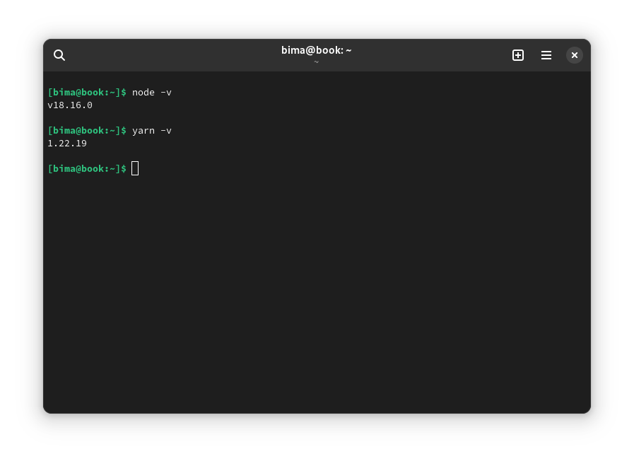

Hello everyone!

In this post, I will share a step-by-step guide on how to use Yarn in your JavaScript projects. [Yarn](https://yarnpkg.com/) is a popular package manager for JavaScript, designed to improve speed, reliability, and security when managing project dependencies. Let's get started!

## Step 1: Installing Yarn

1. First, make sure you have Node.js installed on your computer. You can [download and install](https://nodejs.org/en/download) it from the official Node.js website.
2. Once Node.js is installed, open the terminal or command prompt and run the command `node -v` to verify the successful installation.
3. Next, [install Yarn](https://yarnpkg.com/getting-started/install) by running the command `npm install -g yarn`. This will install Yarn globally on your computer.

## Step 2: Creating a New Project

1. Open the terminal or command prompt and navigate to the directory where you want to create your JavaScript project.
2. Run the command `yarn init` to create a new project with initial configuration. You will be prompted to fill in some information like the project name, version, description, and more.
3. After providing the required information, Yarn will generate a `package.json` file that contains your project configuration.

## Step 3: Managing Dependencies

1. To add a new dependency to your project, run the command `yarn add dependency-name`. Replace "dependency-name" with the package name you want to add. For example, `yarn add axios` will install the Axios package into your project and update the `package.json` file with the new dependency information.
2. If you want to add a dependency as a development dependency, run the command `yarn add dependency-name --dev`. This is useful for dependencies only required during development, such as testing tools or bundling setups.
3. Yarn also supports removing dependencies with the command `yarn remove dependency-name`. This will remove the package from your project and update the `package.json` accordingly.

## Step 4: Managing Scripts

1. In the `package.json` file, you can add custom scripts to be executed using Yarn. These scripts can be used for specific tasks, such as running a development server or building the project.
2. Open the `package.json` file and find the `"scripts"` section. There, you can add a new script with the format `"script-name": "command"`. For example, `"start": "node index.js"` creates a `start` script that runs the `index.js` file using Node.js.
3. Once you've added a script, you can run it with the command `yarn script-name`. For example, `yarn start` will execute the `start` script you added.

## Step 5: Running the Project

After managing dependencies and adding the necessary scripts, it's time to run your JavaScript project using Yarn.

1. Open the terminal or command prompt, ensuring you are in the JavaScript project directory.
2. To run a script you've added, use the command `yarn script-name`. For example, if you have a script `"start": "node index.js"` in your `package.json` file, run the command `yarn start`. This will execute the script and start your application or server accordingly.
3. If you want to run a script directly without mentioning `yarn`, you can use the command `yarn run script-name`. For example, `yarn run start`.
4. Additionally, you can use built-in scripts like `yarn install` to install the dependencies defined in the `package.json` file or `yarn build` to build your project for production.

With the above steps, you can easily run your JavaScript project using Yarn!
