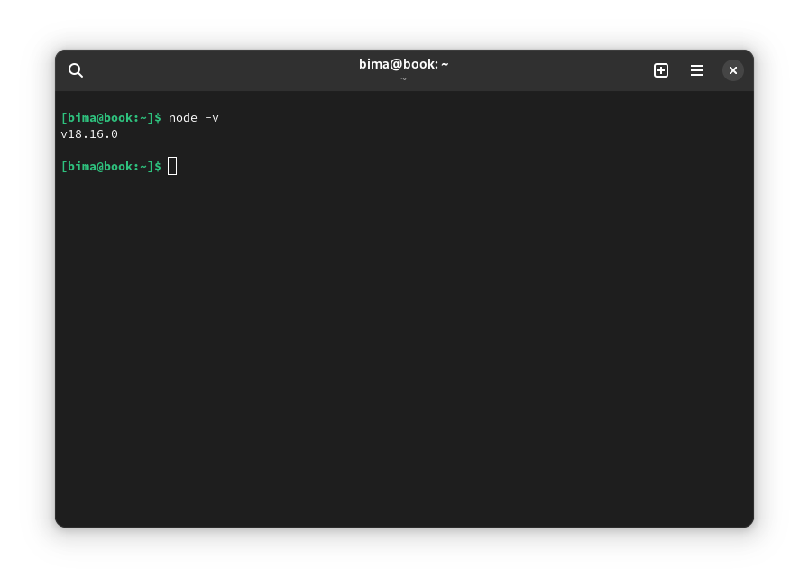

Hello everyone!

Today, I will share a step-by-step guide on how to build an application using ReactJS. [ReactJS](https://legacy.reactjs.org/) is a popular JavaScript library for building interactive and responsive user interfaces (UIs). Let's get started!

## Step 1: Setting Up the Development Environment

Before we begin, make sure you have Node.js installed on your computer. If you don't have it yet, download and install Node.js from the official [Node.js website](https://nodejs.org/en). Once installed, open the terminal or command prompt and run the command `node -v` to ensure the installation was successful. Next, you need to install Create React App by running the command `npm install -g create-react-app`. This will allow you to easily create ReactJS projects.

## Step 2: Creating a ReactJS Project

1. Open the terminal or command prompt and navigate to the directory where you want to create your ReactJS project.
2. Run the command `npx create-react-app project-name` to create a new project. Replace "project-name" with your desired project name.
3. Once the process completes, navigate into the project directory by running the command `cd project-name`.

## Step 3: Editing the ReactJS Application

1. Inside the project directory, you will find the pre-generated file structure for the ReactJS project.
2. Open the project in your preferred text editor or Integrated Development Environment (IDE).
3. The main application file in ReactJS is located in the `src` directory. You can start editing the `src/App.js` file to modify the application's content and appearance. You can also create new components and import them into the `App.js` file.
4. Additionally, you may edit the `src/index.js` file if needed, but for simple projects, it is usually not necessary.

## Step 4: Running the ReactJS Application

1. Return to the terminal or command prompt, ensuring you are still in the project directory.
2. Run the command `npm start` to start the ReactJS application in development mode.
3. Open your browser and access `http://localhost:3000`. You will see your ReactJS application's interface there.
4. Every time you save changes to your project files, the page will automatically reload in the browser.

## Step 5: Implementing Additional Functionality

1. To add extra functionality, such as using APIs or implementing routing, you can utilize suitable ReactJS libraries like Axios or React Router.
2. Install the required libraries by running the command `npm install library-name`.

Congratulations! You have successfully created an application using ReactJS. Now, you can begin developing more complex applications by leveraging the features offered by ReactJS.

I hope this guide is helpful for those who are interested in learning ReactJS.
